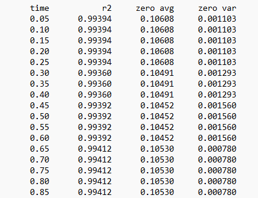

# Overview

This tool monitors the contrast transfer function (CTF) from a transmission electron microscope during operation. These instruments use a highly-focused electron beam and a series of electromagnetic lenses to perform nanometer-scale imaging, at resolution far exceeding that of an optical microscope. 

Operation of the instrument is highly technical. A particular challenge is the selection of the "defocus" parameter; novice operators will tend to maximise contrast at the expense of detail, reducing the spatial resolution of the image.

This tool is designed to assist with these challenges. It processes a time-series from the microscope, and performs fourier transformation, radial integration, and fitting of the contrast-transfer function. It condenses these into simple metrics which can be monitored by the operator during measurement.  

# Summary:

- parses stacked greyscale .tif or .avi

- performs a fast fourier transform, converting real-space images to frequency-space

- performs azimuthal averaging to obtain profiles of intensity vs frequency

- applies a series of radial masks to evaluate anisotropy

- fits the contrast transfer function to these profiles, and plots the result

- reports r-factor, position of first minimum, and variance in first minimum with angle

# Method

The microscope images can be either images or movies, in real-space (ie. a conventional image), or frequency-space. 

- Images are read in as a stack, from either .tif or .avi
- Fast Fourier transform is applied to real-space images
    - src.radial.calculate_2dft()
    - The effect of the CTF is far more apparent in frequency space. The first zero-position can be intuited as the first minimum in the frequency domain:

  
   

#
The resulting frequency-space image is then azimuthally averaged, and fit with the CTF
- The azimuthal average is calculated as a radial profile of the image
  - src.radial.radial_profile()
  - this produces a 1D plot of intensity vs 1/radial distance
  - the first zero is often apparent in this profile as an initial minimum

A modified contrast-transfer function (CTF) is fit to the resulting curve. 
- in src.radial.fmodel()
  - uses scipy.curve_fit() with bounds of param (*/) Bf, where Bf is any of (1.01, 1.3, 2.0, 99), set in config.py

  
   

- k is the known spatial frequency (ie. the x)
- the parameters C_s and λ are known properties of the microscope
- additional terms in the modified function are: 
  - an exponential decay term to model loss at increasing frequency
  - Δz is the parameter of interest, defocus, which affects the position of the first minimum
  - a linear constant to model background
  - a gaussian at k=0 to model scatter from the direct beam
- Finally, the first minimum is determined as the point where the sin function first crosses 0. This is largely dependent on Δz
#

In order to identify anisotropy (ie. shifts with orientation due to lens drift), the process is repeated with a series of rotating masks.
- the frequency-space image is masked at high and low frequency
- a series of sector-masks are rotated around the image centre
    - src.radial.sector_mask()
- the azimuthal profile and CTF fit are calculated for the output of each sector mask
- the profiles and fits are saved for review

  
   

Finally, a series of simple metrics is calculated from the fits for each image- and sector- pair

  
   

Metrics:
- the timestamp for the frame
  - (note that sequential images are often identical)
- r^2, average quality of fit for the CTF
- average zero, the average spatial-frequency for the first minimum across all sector averages
- variance in zero, the variance in the position of the first minmum across sector averages

# Usage

The tool is run as a script from core.py, or Jupyter notebook explore.ipynb

An example dataset is provided in ./data

The path to the dataset to be analysed is set in config.py, together with various flags and control parameters. 
