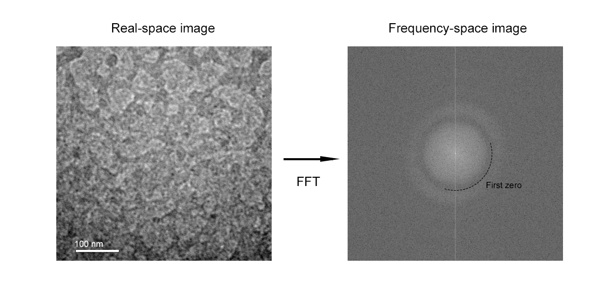
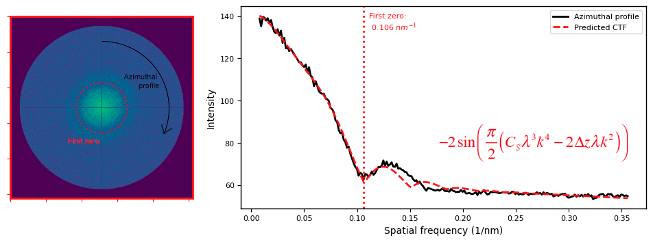
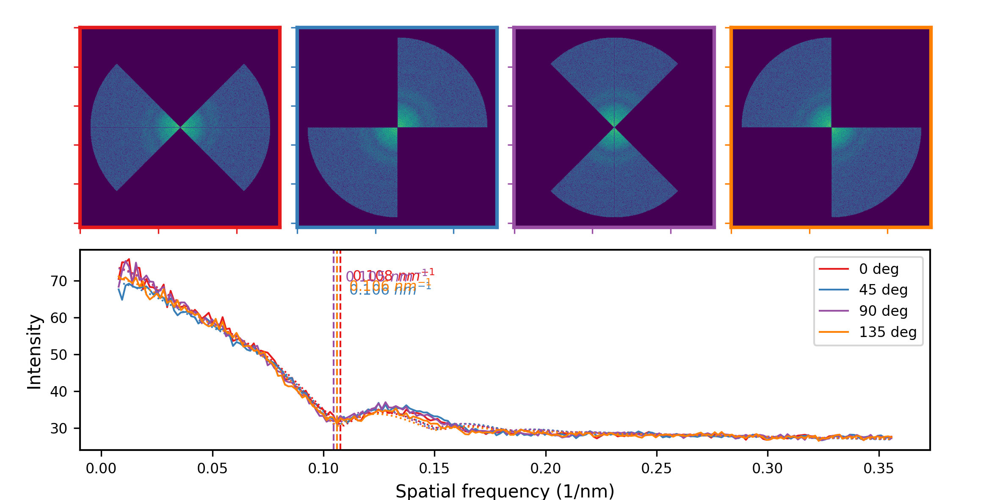

# Overview

This tool monitors the contrast transfer function (CTF) from a transmission electron microscope during operation. These instruments use a highly-focused electron beam and a series of electromagnetic lenses to perform nanometer-scale imaging, at resolution far exceeding that of an optical microscope. 

Operation of the instrument is highly technical. A particular challenge is the selection of the "defocus" parameter; novice operators will tend to maximise contrast at the expense of detail, reducing the spatial resolution of the image.

This tool is designed to assist with these challenges. It processes a time-series from the microscope, and performs fourier transformation, radial integration, and fitting of the contrast-transfer function. It condenses these into simple metrics which can be monitored by the operator during measurement.  

# Summary:

- parses stacked greyscale .tif or .avi

- performs a fast fourier transform, converting real-space images to frequency-space

- performs azimuthal averaging to obtain profiles of intensity vs frequency

- applies series of radial masks to evaluate anisotropy

- fits the contrast transfer function to these profiles, and plots the result

- reports r-factor, position of first minimum, and variance in first minimum with angle

# Method

The data is....

- fileformat...
    - (src.radial)

  
   

#

  
   

#

  
   

# Usage

The tool is run as a script from core.py, or Jupyter notebook explore.ipynb

An example dataset is provided in ./data

The path to the dataset to be analysed is set in config.py, together with various flags and control parameters. 
